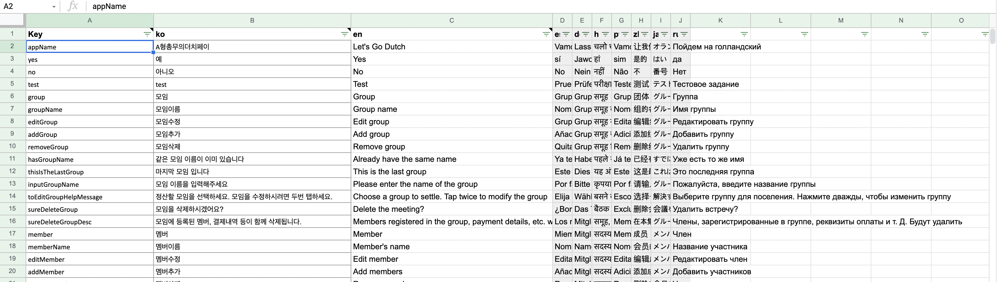

# GetX Google Sheets 번역코드 생성기

`GetX` 패키지의 `.tr` 번역을 사용할때 일일이 언어 코드별로 `localization.g.dart` 코드를 작성해야되기 때문에 매우 불편하고 지루합니다.
이 프로그램은 `Google sheet` 의 번역 데이터 시트를 통해 `GetX` 의 `localization.g.dart` 소스코드를 자동으로 생성해주는 프로그램입니다.


## How this program works


먼저 변환프로젝트를 로컬로 가져옵니다.
```
git clone "https://github.com/enoosoft/gs_translation.git"
```

그리고 아래와 같이 구글 번역 시트 문서를 만듭니다.



[샘플시트](https://docs.google.com/spreadsheets/d/1VsYZH_y7bPZr8gE7rg-9PHnrOCKVKwBO7JjBpdOiEjw/edit#gid=0) 를 복사하여 만들면 됩니다. Google 시트를 사용하면 간단한 수식으로 필드를 번역할 수 있습니다. `=GOOGLETRANSLATE(B4,en,ko)` 필드 `B4`의 문구를 영어(`en`)에서 스페인어(`es`) 등으로 번역할 수 있습니다. 구글시트에서 `key`, `en`, `ko` 열이 필수 입니다. 구글 번역 api는 영어에서 다른 언어로 번역하는 것이 더 자연스럽기 때문에 번거롭지만 `en` 을 직접 입력하도록 했습니다.

그런 다음 번역프로그램 루트 폴더에서 구글시트 ID `--doc`와 프로젝트 폴더명 `--path`, 파일명 `--file` 을 넣고 `main.dart` 를 아래와 같이 실행합니다.

```sh
dart bin/main.dart --doc '1VsYZH_y7bPZr8gE7rg-9PHnrOCKVKwBO7JjBpdOiEjw' --path ~/Sync/Works/godutch/lib/home/intl --file messages.dart

```

이렇게 하면 messages.dart 파일에 아래와 같이 변환된 코드가 생성됩니다.
```dart
import 'package:get/get.dart';

class Messages extends Translations {
  @override
  Map<String, Map<String, String>> get keys => {
    'ko': {
'About': 'About',
'Astronomical calendar': '천문달력',
'Input text here': '텍스트를 입력하세요',
'Copy': '복사',
'Clear': '삭제',
'Cancel': '취소',
'Confirm': '확인',
'Select': '선택',
'app description': '천문현상을 볼 수 있는 달력입니다',
'Share App': '앱공유',
'😊Have a nice day🎉 - EnooSoft': '😊좋은 하루 보내세요🎉 - EnooSoft',
},
'en': {
'About': 'About',
'Astronomical calendar': 'Astronomical calendar',
'Input text here': 'Input text here',
'Copy': 'Copy',
'Clear': 'Clear',
```

그리고 `GetX` 프로젝트에서 아래 방법으로 번역을 사용하면 됩니다.

```dart
Text('Input text here'.tr)
```

`GetX localization`에 대해서는 [여기](https://pub.dev/packages/get#internationalization)에 자세한 내용이 있습니다.


이 프로그램은 아래 블로그를 참조하여 개선하여 만든 프로그램입니다.  

### 원저자 및 출처  

[Jeff McMorris](https://jeffmcmorris.medium.com/)  
[GetX Google Sheets Translation Code Generator](https://jeffmcmorris.medium.com/getx-google-sheets-translation-code-generator-b970543d67fc)  
[Github](https://github.com/delay/getx_google_sheets_translation_code_generator)
